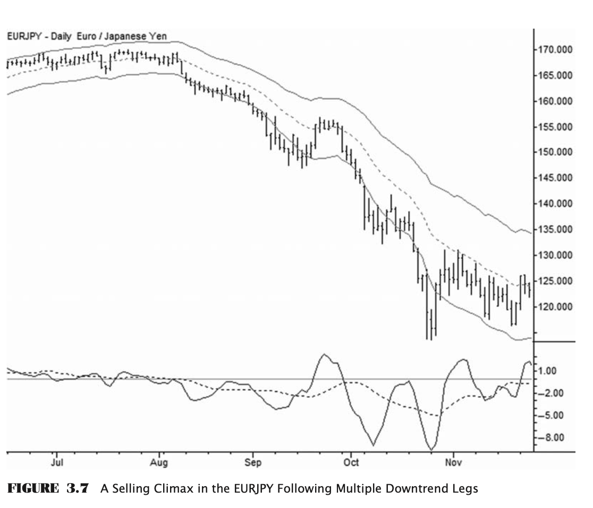

# Summary Notes On The Art and Science of Technical Analysis

- A positive expectancy results when the trader successfully identifies those moments where markets are slightly less random than usual,
and places trades that are aligned with the slight statistical edges present in those areas
- The bottom line is that you must have an edge. If you are not trading with a statistical advantage over the market, everything else is futile
- An edge can be described as the ability to find entry and exit poins in the market, so that in the long run and a large sample size later,  the sum of your wins is greater than your losses
- Market does have memory because the market is determined by traders who associate prices with fear, anger, hopes, etc.
- BUT NOTE THAT IT IS BUYING AND SELLING BY TRADERS THAT MOVES PRICES
- The more aggressive the buyers, the further they will lift offers and the less they will wait between spurts of buying. This type of action, and the memory of other traders around previous inflections, creates slight but predictable tendencies in prices.
- Buying and selling pressures leave patterns. The aim is to find places where these pressures create opportunities in the form of non-random price action(pg 6)
- The most import fact (the holy grail) is that every edge we have, as a technical trader, comes from imbalance of buying and selling pressures. Limit the involvement in the market to those points where there is an actual i balance, and there is the possibility of making profits.
- WE DO NOT TRADE PATTERS IN THE MARKET—we trade the **underlying imbalances** that create those patterns.
- As a small trader, the solution to making money is to focus on 3-day to 2-week swings

## **Choosing time frames**
- Looking at multiple time frames provides context for and inform patterns on a single time frame
- The primary time frame of focus is called the Trading Time Frame(TTF)
- A higher time frame(HTF) chart shows the bigger picture of where the market is, while the lower time frame(LTF) charts is used to find entry points
- Time frames should be related to each other by a factor of 3 to 5. E.g., 30-minute charts/5 or 10 minute chart/1 minute chart i.e., 30/5 or 10/1
- Using a 20-minute chart in conjunction with a 30-minute chart probably adds no new information, as the two charts will be very similar
- Note that vertical distances on charts scale with the square root of the ratio of the time frames.
- For instance, if a trader has been trading a system on 5-minute charts with $0.25 stops and wishes to transfer that to 30-minute charts. the stops will have to be adjusted to about $0.61 (0.25 * √(30/5)) 
- Be consistent with the timeframes and trading styles you are using. Don't be quick to modify this unless you have evidence that it is not working.

## **Market Action**(pg 13 to 15)
- Price action is market/price movement
- Price action creates market structure.  Market structure is the record of how prices moved in the past
- With respect to `THE FOUNDATION OF TECHNICAL ANALYSIS`, instead of using these complex vocab borrowed from Maths, Signal processing, etc, he proposes that market action appears to be the result of two interacting forces: a `motive force` that attempts to move price from one level to another and a `resistive force` that opposes the motive force. These forces represent the sum of all analysis and decision making at any one time.
- The normal state of existence of markets most times is a state of equilibrium where the 2 forces are in equilibrium. Market action at this point conforms to the random walk.  These situations are the ones we want to avoid as technical traders because there is no clear statistical edge in a randomly driven market.
- Markets have a varying degree of liquidity and ability to take large orders. Eventually,  there will be a failiure of liquidity on one side and the market will make a sudden, large move in one direction. No matter what caused this, in theoretical terms, the **motive force has overcome the resistive force**. This sudden movement is called `impulse move / momentum move` 
- There are 2 options from this point:
    1. Resistive forces overcome the motive forces and market finds balance again (the most common option)
        - Balance can be at a new level or price can retrace its course back to the preshock levels
    2. Large spike leads to continued movement in the same direction. A feedback loop will be created where the market makes a large movement, which, in turn,  provokes another large price movement, and the market trends
        - The market structure of this treding movement is a series of directional moves alternating with non-directional periods. During the non-directional periods, the market is resting and absorbing the previous move

## **PRICE ACTION AND MARKET STRUCTURE ON CHARTS**(pg 15 to )
- The key elements of market structure are `pivot points` and the `swings` connecting them, both of which may be evaluated either in price (the vertical axis on a chart), in time (the horizontal axis), or in a combination of the two.
- Price action is subjective, while market structure is concrete.
- Price action is inferred from market structure. (i.e, IMO, based on the market structure, we can tell where price is going)
- Price action and market structure are specific to time frames, though price action is often visible as the market structure of lower time frames

### **Pivot points**
- The basic units of market structure on any time frame are pivot highs and lows (also called swing highs or lows)
- A pivot high is a `bar` that has a higher high than the bar that came before it and the bar that comes after it
- The bar’s high represents the high-water mark past which buyers were not able to push price, and can be considered a very minor source of potential resistance
- A pivot low is a `bar` that has the lower low than the bar before and after it.'
- Note that it is possible for a bar to be `both a pivot high and a pivot low at the same time`,  and that pivot highs and pivot lows are very common.  

### **Length of swings**
- The market structure tells us about the balance of buying and selling pressure in the market. The core concepts are:
    - When buyers are stronger than sellers, upswings will be longer, both in price and in time, than downswings (i.e., the trend creates a consistent pattern of higher pivot lows and higher pivot highs)
    - When sellers are in control, downswings will be longer than upswings. (i.e., creating a consistent pattern of lower pivot lows and lower pivot highs)
    - Significant support and resistance levels are visible as rough areas (not precise lines) beyond which **pivots have been unable to penetrate.**
    - When there is relative equilibrium, there is no clear pattern to the swings.

**The Market Cycle and the Four Trades**
WYCKOFF’S MARKET CYCLE
- Accumulation
- Markup
- Distribution
- Markdown

#### 1. Accumulation
- Avoid trading here
- Accumulation is the beginning phase of the market cycle, where large players quietly buy assets to build their positions without alerting the public
- This process involves **buying slowly over time to create the illusion of a market in equilibrium when, in fact, smart money is accumulating for an uptrend**
- Market players need to be alert for signs of failed accumulation and understand that these areas are complex and challenging to time accurately
- ***One common pattern associated with accumulation is the "spring," where large buyers test the market at the bottom of the range to gauge interest and accumulate inventory without causing prices to spike***
- ***The spring is called a failure test at the bottom of the range in modern terminology***
- By observing market reactions and price action, these players can adjust their buying strategies accordingly
- If the market responds positively to their absence, it indicates underlying buying interest
- Institutions that engage in accumulation tend to be slow-moving and make significant purchases over an extended period of time
- Despite this gradual process, there are critical points in time that require attention, such as drops below the accumulation range
- These moments reveal important information about market dynamics and potential buying interest at specific price levels
- Recognizing patterns of accumulation on price charts can provide valuable insights for traders
- **Candles with long shadows below support levels, but with minimal closes below it, can signify accumulation**
- By understanding these subtle patterns and their context within the market, traders can enhance their probability-based trading strategies and anticipate potential uptrends
- During the accumulation phase, crowd psychology plays a crucial role in shaping market sentiment
- While large players are quietly accumulating assets, the general public remains indifferent to the market, leading to a lack of mainstream coverage
- This invisibility and lack of attention create an ideal environment for smart money to position themselves before the market breaks out into the next phase of the cycle
- Overall, recognizing and understanding the process of accumulation in the market can help traders navigate through complex market conditions, identify significant reversal points, and potentially capitalize on future uptrends
- By combining technical analysis with an awareness of market psychology, traders can develop a comprehensive approach to trading in various market environments
-

#### 2. Markup: The Classic Uptrend
- The second part of the market cycle is the uptrend (markup), where the actions of smart money are less clear compared to the downtrend
- Institutions may hold onto their stock until prices reach a favorable point to sell, or they may actively trade based on the trend fluctuations
- Trends typically start quietly out of accumulation, with little public attention
- As prices rise, people start to take notice, initially reacting with disbelief and wanting to go against the trend
- Even if prices rise above previous ranges, the public tends to see it as too high and may short the market
- As trends progress, early shorts are forced to cover their positions, pushing prices higher
- The public gradually accepts the trend and starts buying the dips
- Dissenting opinions about the trend can fuel further growth
- Trends consist of with-trend legs and pullbacks, with traders focusing on their relationship to previous movements
- Trading plans in trends usually involve buying pullbacks or breakouts
- Understanding the emotional cycle that drives trends is crucial, as market actions are influenced by traders' hopes and fears
- The emotional cycle of trends typically involves disbelief, acceptance, and finally, consensus
- Once everyone agrees on a trend, it may be close to ending
- In some cases, mania sets in, with exaggerated claims about market conditions
- This over-excitement often precedes a market correction caused by increased supply meeting excessive demand
- **Recognizing when market psychology reaches a manic stage is essential for traders**
- **When non-financial media starts reporting on market trends, it may be time to detach from prevailing market sentiment and consider exiting positions or reducing risk**
- This can help traders protect their profits in case of a market reversal

#### 3. Distribution—The End?
- Nothing lasts forever, including rising prices in the market
- Eventually, increased supply will lead to a balance being achieved, halting the price increase
- Typically, there are two main ways this can happen
- The manic blow-off end-of-trend pattern is rare but significant, offering both opportunities and risks
- More common is when the uptrend loses momentum, transitioning into a sideways trading range
- Large market operators, who previously built up positions and held onto them during the markup phase, now start selling their inventory to the public (distribution phase)
- While accumulation and distribution areas may appear similar to the untrained eye, subtle differences exist
- ***During distribution, there is less rebound when prices drop below support, and false breakouts may occur at the top of the range***
- Prices will drop below support at the bottom of the range and will fail to bounce. The market will roll over into the last phase, markdown.
- These false breakouts at the top of the range leave the candles with long shadows above the highs of the range. This pattern is the opposite of the Wyckoff spring, and is usually called an ***upthrust***.
- 
- The public tends to remain optimistic during distribution, interpreting any potential breakout as a sign of a new uptrend
- However, careful analysis of market structure and price action is necessary to differentiate between accumulation and distribution areas, as markets can enter extended sideways ranges during uptrends
- Risk management should be a top priority in trading plans, given the uncertainty of market movements

- Fractal markets means that the same patterns appear in very long-term markets as in very short-term markets
- In the shorter time frames, patterns are bounded by liquidity
- Note that patterns may not be tradable on all time frames.

### The 4 Trades
- There are two trend trades:
    - trend continuation 
    - trend termination,
- There are two support and resistance trades:
    - holding 
    - failing.
- Traders should diversify setups to include at least two counterbalancing strategies for optimal results.
- For example, breakout traders should understand failed breakout patterns, while trend pullback traders should also be able to trade trend reversal patterns
- This familiarity with pattern failures enhances trading success by providing a more comprehensive understanding of market behavior and potential outcomes
- If you focus only on 1 aspect, you may try to force unrealistic trades because you find it hard to wait for the perfect trade opportunity

NB:
fading: going against the trend 
You can be successful focusing on 1 aspect only. But having 2 has better results

#### Trend continuation (pg 41-42)
- Trade in the direction of the trend
- Trend can be just developing or already well established
- Common strategies include using pullbacks in a trend for further gains, breakout trades within the trend, or getting in early on a new trend
- These trades are best during **markup or markdown stages**, but can also be attempted during accumulation or distribution transitions
- When trading in uncertain areas, it is crucial not to be stubborn. ***Listen to the message of the market and adjust***
- E.g., An aborted breakout of accumulation into an uptrend could indicate potential distribution
- Trend continuation plays offer high-probability opportunities, as there is a statistical edge for trend continuation aligned with price behavior principles
- ***Defining both risk and trade expectation before entry is essential***, though it can be challenging with trend continuation trades
- ***The key is identifying points where the trend trade is conclusively wrong / where the trend is violated***
- Some trades may not have clear points of trend violation near the entry, making it difficult to determine risk/reward
- While successful trades may exceed expectations, ***profits are typically taken near previous highs***
- Common failure patterns include insufficient with-trend pressure leading to a rollover to another range or distribution, making it important to plan for complex pullbacks in strong trends
- Traders trading simple pullbacks need to be aware that many pullbacks in strong trends are complex, two-legged consolidations (see Chapter 3: On Trends), so a good trading plan will plan for that possibility
- Dramatic failures are rare but possible, especially in crowded trend continuation plays in overextended markets

#### Trend Termination (pg 42-43)
- Precise terminology is crucial when engaging in trend reversal trades
- It is important to accurately define trader expectations
- True trend reversals are rare and carry high reward/risk profiles
- ***Typically, traders aim to sell near the high of a trend or buy near the low, anticipating a reversal***
- However, it is more common for trends to simply stop rather than reverse
- ***Trend termination trades involve identifying spots where an uptrend shifts to distribution or vice versa***
- Some traders specialize in recognizing overextended trends and taking quick countertrend positions for short reversals
- ***These trades are risky and best suited for experienced traders***
- While trend termination plays are not high-probability, winning trades offer significant rewards
- Trade management is crucial to avoid substantial losses, particularly when fading trends
- Maintaining iron discipline is essential for consistent success in trend termination trades, as impulsive decisions can lead to severe losses
- It is important to understand the market structure and trade goals when engaging in trend termination trades

#### Support or Resistance Holding (pg 43-44)
- Support/resistance trades typically occur in accumulation/distribution areas during sideways market movement, but with-trend traders may also enter trades by buying support in the trend
- Traders should establish a clear classification system that aligns with their market approach
- Trading patterns and rules are essential for structuring price action effectively
- Examples of well-defined trading ranges can be found on historical charts, where you can buy with little risk as the market bounces off the bottom price
- However, clean support is rare, with dropouts below actually strengthening support by shaking out buyers
- For short-term traders, trading around these patterns requires thought
- Will you sell when levels drop, accepting small losses, or position small in the range, buying more if it drops further? Dealing with scaling in means easy wins won't be at full size
- Support/resistance holding trades generally have low reward/risk ratios, as support indicates buying pressure imbalance
- Avoiding equilibrium areas is common, leading to suboptimal trade setups
- Failed breakouts, however, are high-probability trades, with potential for dramatic moves when everyone is leaning the wrong way
-

#### Support or Resistance Breaking or Failing
- Support/resistance breaking trades are classic breakout trades that typically occur at the end of accumulation or distribution phases, marking the transition into a trend phase
- While they can also be found within trends, these trades often involve high volatility and low liquidity, increasing the associated risks
- Despite their appeal to traders, breakout trades are known to have a high failure rate
- Successful execution in these trades requires advanced skills to navigate the challenges of slippage and market thinness
- These trades can also occur within trends, often in lower time frames
- The best resistance breaking trades are driven by ***large-scale buying imbalances, with patterns like holding higher lows into the resistance level before the breakout***
- Traders focusing on breakout trades spend time studying setups and maintain a watch list of potential candidates
- Unplanned, reactive breakout trades are unlikely to lead to long-term success

## Market Structure
### Fundamental Pattern
- The fundamental pattern of market movement on all time frames is this: a movement in one direction, a countertrend retracement in the other direction, and another leg in the original direction.
- This structure is a repeating pattern found in trends on all time frames, known as ***impulse***, ***retracement***, ***impulse***
- The significance of this pattern varies depending on the time frame
- The pattern exists to help traders buy large amounts without impacting prices
- Traders buy small amounts, wait, then buy more in order to fill their order without moving the market too much
- Smart traders or algorithms plan their buying based on the market's response to their orders, judging the supply and selling conviction in the market
- A single trader filling a buy order in a market dominated by noise traders would create a similar price pattern
- There must be a firm theoretical foundation for anything in the market; you should be able to clearly articulate why something should be the way it is.

#### Fractal markets
- A fractal is a pattern where the parts look like the whole
- Markets are also fractal, meaning similar patterns appear on all time frames, from single-tick charts to yearly patterns
- These patterns build on each other, with smaller time frames forming larger time frames
- Each trend leg consists of an impulse, retracement, impulse pattern, which breaks down into the same pattern on lower time frames
- This structure can extend down to the one-tick level, with larger patterns setting up trends on higher time frames
- Understanding this market structure is crucial as no pattern exists in isolation on a single time frame
- The market is compared to Russian nesting dolls, where digging into one time frame reveals similar structures on lower time frames, all the way down to the tick level
- Traders usually focus on a specific time frame, but it's important to recognize that patterns on lower time frames create patterns on the trading time frame, and are influenced by evolving patterns on the next higher time frame
- Lower time frame interactions impact price action, while higher time frames provide context or motivation for patterns within the trading time frame

### Trend Structure
- Focus on how trend starts, unfolds and how it ends
- A trend shows an imbalance in buying and selling pressure, driving price changes until the market reaches a new equilibrium
- Recognizing trend patterns is crucial to understand if the trend will continue or end

#### Impulse and Momentum
- The first part of a trend is called an impulse move, which is a strong advance caused by buying pressure surpassing selling pressure
- When a market has been trading in a range for a while, a sudden strong move in one direction indicates a new imbalance in buying or selling pressure
- Impulse moves are key in driving trends, and as long as each leg of the trend move with momentum consistent with previous moves, it is favorable to buy pullbacks in an uptrend or short pullbacks in a downtrend
- However, sharp contratrend momentum during a pullback, like in the example of Sugar futures breaking the trend pattern, signals that the trend is likely broken, and it is best to avoid trading with the trend until further notice
- Economics 101 explains that when demand goes up, prices in the market will also go up as the market looks for a new price to balance supply and demand
- This process involves certain patterns that technical traders can spot, such as new highs or lows in momentum, similar new trend movements, and the lack of strong opposite momentum during pullbacks

#### Climaxes
- Buy pullbacks after an upward move or short bounces after a strong selling move - that's a good strategy for trading trends
- But it's not that simple
- There's a common issue in technical analysis
- ***Strong moves can signal exhaustion, leading to the end of a trend***

- In the above example where a climax marked the end of a trend. This type of structure is often referred to as a **parabolic move** or a **blow-off**.
- Emotional buyers push the market to extreme highs, but eventually, there are no more buyers left
- Any pause can trigger a crash as there is no support
- When momentum shifts, weak traders panic sell, adding to the downward pressure
- Signs of a buying climax include:
    - fast trends
    - big range bars
    - free bars above the channel
    - subsequent collapse
- During a blow-off, the range of the bars becomes much larger as the trend steepens and moves away from the average
- This indicates increased volatility, particularly intraday volatility
- A notable volume spike usually occurs near the climax move's extreme point, with bars often trading significantly higher volumes compared to the instrument's average
- In a buying climax, many bars close near their high, while in a selling climax, they close near their low, suggesting intraday exhaustion i.e., ==this shows that the climactic conditions extend to the intraday (or intrabar if a weekly or monthly chart) time frame as well, which are probably showing exhaustion or climaxes on their own time frames==
- ***It is uncommon to see bars completely outside Keltner channels, known as free bars, which can signal a potential climax***
- The same pattern can be seen for the downside 
- A climax alone may not be enough to justify taking a position against the trend, but it does serve as a clear risk point
- **Do not enter pullbacks following potential climaxes.**
- Trend traders should be alert when a climax occurs
- Notice that these examples have come after extended, mature trend runs.
- Climactic conditions are only meaningful in relation to recent market history
- In trading ranges, volatility is lower, so indicators may be skewed
- **Climax patterns in range breakouts are harder to identify and often result in continuation rather than reversal**
- **It is best to look for climaxes after extended trends**

NB:
Summary Xtics of a blowoff
1. Range of bars increases as trend steepens and pulls away from the average (see Keltner link below)
2. Bars close at or near their high in a buying climax which indicates intraday exhaustion.
3. Presence of free bars which indicates a potential climax

> [A more detailed look of how to use Keltner channels](https://www.investopedia.com/terms/k/keltnerchannel.asp)